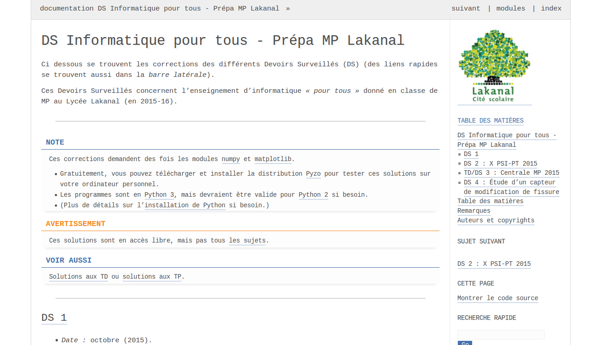
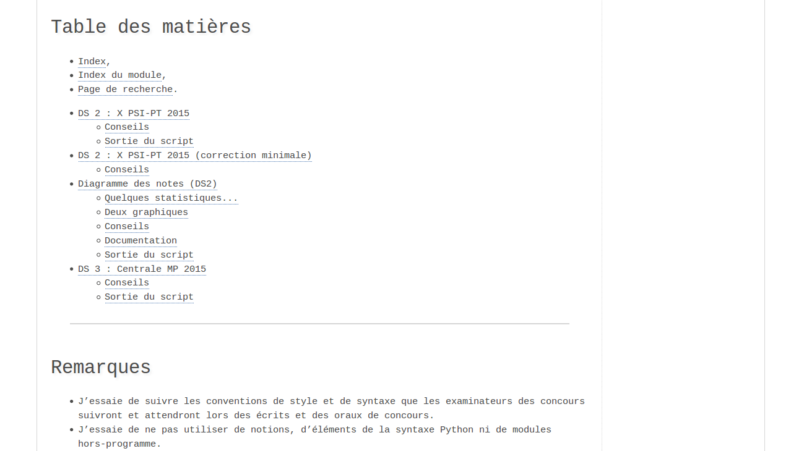
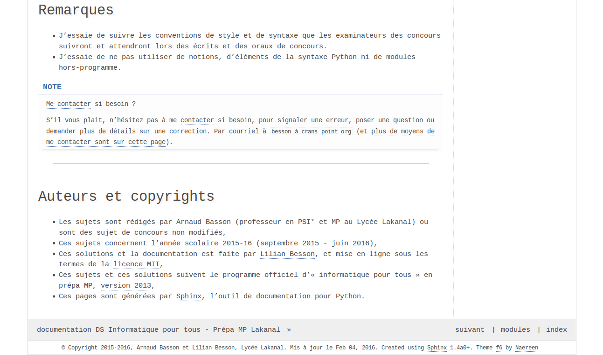

# *F6 theme* for [Sphinx](http://sphinx-doc.org/)
> A clean and minimalist theme for [Sphinx doc](http://sphinx-doc.org/).
> Mostly white -> ``#ffffff`` -> **f6**.

----

## How to use it?
### Installation
Clone the repository, copy the files [theme.conf](theme.conf), [layout.html](./layout.html)
(and the [static](./static) folder),
to a folder ``_themes/f6/`` located in your Sphinx project:

    $ git clone https://github.com/Naereen/f6_sphinx_theme/
    $ cd f6_sphinx_theme/
    $ cp * /path/to/your/project/

### Usage
Change your [conf.py](http://sphinx-doc.org/config.html#options-for-html-output) sphinx file to:

    html_theme = 'f6'
    html_theme_path = '/location/to/the/files/f6/'

1. Change the ``html_theme`` parameter to ``f6``.
2. Change the ``html_theme_path`` to the location containing the f6 files.

----

## Examples
### [Screenshots](./screenshots)

### Live demos?
- [Vimalkumar's demo](http://vimalkumarvelayudhan.com/sphinx-themes/f6/html/index.html),
- [folium documentation](https://folium.readthedocs.org/en/latest/),
- [pi-qmc documentation](http://pi-qmc.readthedocs.org/).

----

## About
### Authors?
- [Forked by](https://github.com/Naereen/f6_sphinx_theme/) [Lilian Besson (Naereen)](https://github.com/Naereen/),
- Original author: [Vimalkumar Velayudhan (vimalkvn)](https://github.com/vimalkvn), copied from [GitHub](https://github.com/vimalkvn/sphinx-themes/tree/master/f6). See [here for more themes](http://vimalkumarvelayudhan.com/sphinx-themes/). Modified from the default Sphinx theme.

### :scroll: License ? 
This plug-in is published under the terms of the [GPL License](http://www.gnu.org/licenses/gpl.html) (file [LICENSE](LICENSE)),
© [Lilian Besson](https://GitHub.com/Naereen), 2016.

